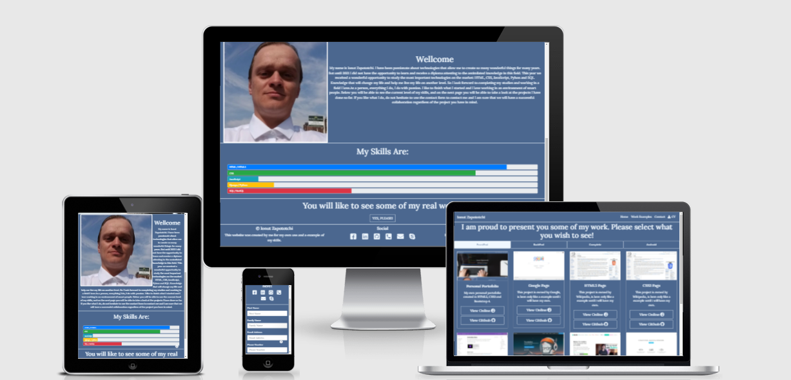
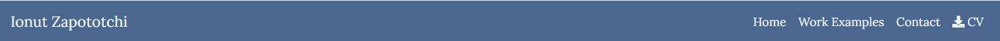
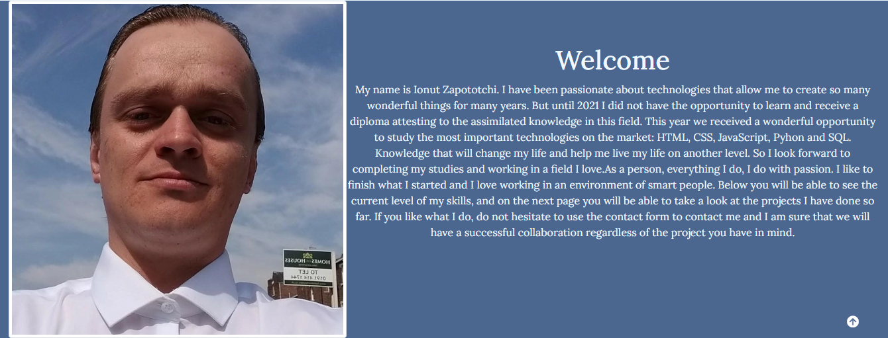

# Ionut Zapototchi Personal Portfolio

Welcome, this project is proof of my skills as a developer. This is also a real project where all the projects I worked on will be posted in time, this serving as my portfolio. This project is also designed so that people who want to hire me can get a better idea of my skills and be able to contact me as easily as possible.

## Features

 _Navigation:_

- Same navigation menu is used across all pages for consistency.

- Navigation was designed to be easy to use and to understand.

- Navigation was aswell designed to work wall on all devices.

 _Index Page - Hero Section_

 

- Hero section have a nice background image with a overlay text, my name and site purpose.

_Index Page - Welcome Section_

- Welcome section have my image and a welcome and presentation text.
- The section is designed to welcome the potential employer and to give him a better idea about who i am.
