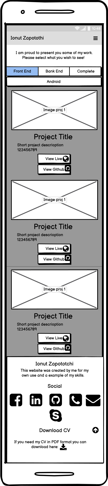

# Ionut Zapototchi Personal Portfolio

Welcome, this project is proof of my skills as a developer. This is also a real project where all the projects I worked on will be posted in time, this serving as my portfolio. This project is also designed so that people who want to hire me can get a better idea of my skills and be able to contact me as easily as possible.

See this project on live enviroment on GitHub Pages here: <https://lseparatio.github.io/personal-portofolio/>

## Features

Click To Expand Features

### Navigation

- Same navigation menu is used across all pages for consistency.

- Navigation was designed to be easy to use and to understand.

- Navigation was aswell designed to work wall on all devices.

### Index Page - Hero Section

 

- Hero section have a nice background image with a overlay text, my name and site purpose.

### Index Page - Welcome Section

- Welcome section have my image and a welcome and presentation text.
- The section is designed to welcome the potential employer and to give him a better idea about who i am.

### Index Page - Skills Section

- Skills section was designed to show in a nice manner to an possible employer my set of skills.

### Index Page - Call to Action Section

- Call to Action Section was designed to do not lose the reader attention and to help him in a easy way to next page.
- This section contain a text and a button that is sending user to next page.

### Work Example Page

- Work Examples page was designed to show all my projects to the user, to provide with some basic information about projects.
- There are 2 buttons to every work example, first leading to Live project page and second to GitHub project.
- User can change the content by selecting the domain of expertise.
- Page is completely responsive:
- Phone example:

- Tablet Example:

### Contact Page - Social Icons Section

- In order to create a connection with reader, i have to "Speack with him", this is what is doing this section.
- Also i provide with 6 contact ways.

### Contact Page - Contact Form

- But if all that contact ways are not enough..

- ...an contact form, contact detaills and map need to be provided.
- All page is full responsive.

### Thank You Page

- Thank you page where user is redirected after form is succesfully submited.

### Custom 404 Page

## The Creation Timeline

Click to open creation timeline

### User Stories

As a site owner:

- I want users to understand fast that this website is for my portfolio.
- I want users to be able to easily navigate my website on any device.
- I want to present myself as best as possible including my skills.
- I want to be easy to contact on multiple platforms.
- I want my website to be accessible to anyone even for screen readers.

As a user:

- I want to be able to view the website on any device.
- I want the menu to be intuitive.
- I want to learn as much is possible about developer.
- I want to know what skills have the developer.
- I want to see what other projects developer did.
- I want to find out who you are.

### Wireframes, i used Balsamiq

Click to expend wireframes

- Mobile Wireframes:

 1. Index Page

 2. Example Page

 3. Contact Page

- Tablet Wireframes:

 1. Index Page

 2. Example Page

 3. Contact Page

- Desktop Wireframes:

 1. Index Page

 2. Example Page

 3. Contact Page

### Tools

- Visual Studio Code ( After i tried some editors it seem i like visual studio and the fact it is saving a local copy of project and i can push to GitHub. )
- GIMP ( For image editing. Briliant open-source editor. )
- Bootstrap 4.6 ( I did this choice after i read in Bootstrap documentation that they have problems with Internet Explorer. )

### Colors

 - I used https://coolors.co/image-picker to pick a color  from my profille image. 

  

